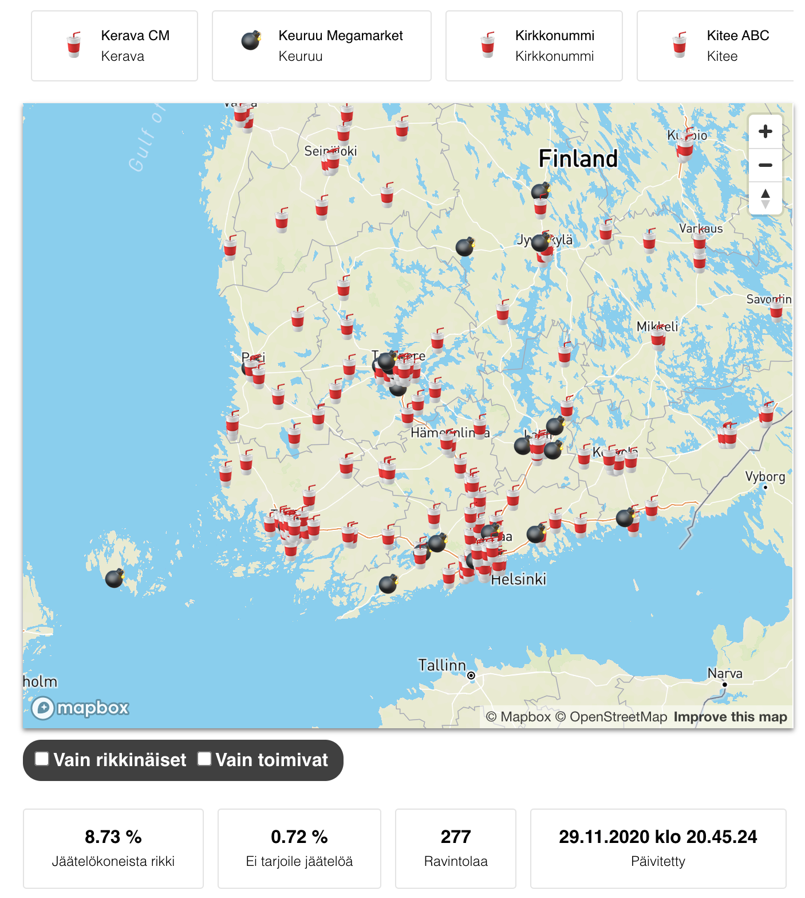
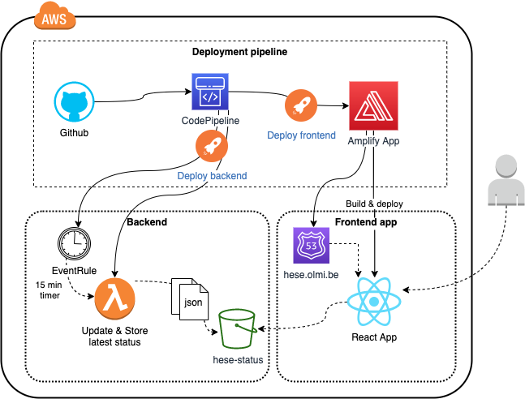

# AWS CDK & AWS Amplify React App

[Hesburger Ice Cream status](https://hese.olmi.be/) - an app for tracking whether the Finnish hamburger chain Hesburger serves Ice Cream at the moment. Inspired by the brokenness of the McDonald's Ice Cream status reporting [McBroken](https://mcbroken.com/).

## How this has been made

The project was bootstrapped with [Create React App](https://github.com/facebook/create-react-app).

AWS infrastructure is built with following technology choices:

* React App for the frontend application
* AWS Amplify for the frontend distribution
* AWS Lambda for updating data
* S3 for status storage
* AWS CDK for infrastructure code
* AWS CDK Pipelines for contiunous deployment

